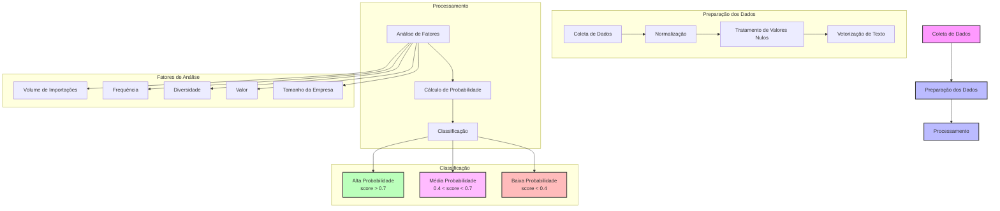

```mermaid
graph TD
    A[Coleta de Dados] --> B[Preparação dos Dados]
    B --> C[Processamento]
    
    subgraph "Preparação dos Dados"
        B1[Coleta de Dados] --> B2[Normalização]
        B2 --> B3[Tratamento de Valores Nulos]
        B3 --> B4[Vetorização de Texto]
    end
    
    subgraph "Processamento"
        C1[Análise de Fatores] --> C2[Cálculo de Probabilidade]
        C2 --> C3[Classificação]
    end
    
    subgraph "Fatores de Análise"
        C1 --> D1[Volume de Importações]
        C1 --> D2[Frequência]
        C1 --> D3[Diversidade]
        C1 --> D4[Valor]
        C1 --> D5[Tamanho da Empresa]
    end
    
    subgraph "Classificação"
        C3 --> E1[Alta Probabilidade<br/>score > 0.7]
        C3 --> E2[Média Probabilidade<br/>0.4 < score < 0.7]
        C3 --> E3[Baixa Probabilidade<br/>score < 0.4]
    end
    
    style A fill:#f9f,stroke:#333,stroke-width:2px
    style B fill:#bbf,stroke:#333,stroke-width:2px
    style C fill:#bbf,stroke:#333,stroke-width:2px
    style E1 fill:#bfb,stroke:#333,stroke-width:2px
    style E2 fill:#fbf,stroke:#333,stroke-width:2px
    style E3 fill:#fbb,stroke:#333,stroke-width:2px
``` 