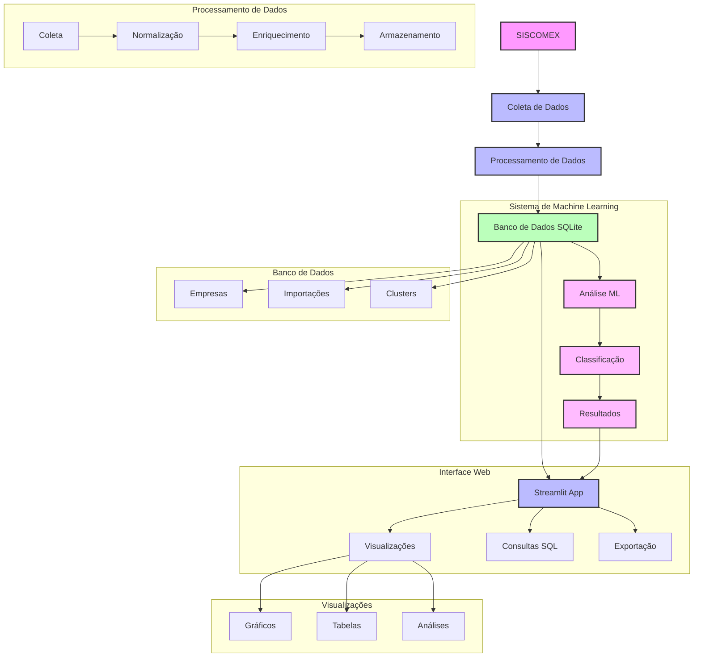

```mermaid
graph TD
    A[SISCOMEX] --> B[Coleta de Dados]
    B --> C[Processamento de Dados]
    C --> D[Banco de Dados SQLite]
    
    subgraph "Processamento de Dados"
        C1[Coleta] --> C2[Normalização]
        C2 --> C3[Enriquecimento]
        C3 --> C4[Armazenamento]
    end
    
    subgraph "Sistema de Machine Learning"
        D --> E[Análise ML]
        E --> F[Classificação]
        F --> G[Resultados]
    end
    
    subgraph "Interface Web"
        D --> H[Streamlit App]
        G --> H
        H --> I[Visualizações]
        H --> J[Consultas SQL]
        H --> K[Exportação]
    end
    
    subgraph "Visualizações"
        I --> I1[Gráficos]
        I --> I2[Tabelas]
        I --> I3[Análises]
    end
    
    subgraph "Banco de Dados"
        D --> D1[Empresas]
        D --> D2[Importações]
        D --> D3[Clusters]
    end
    
    style A fill:#f9f,stroke:#333,stroke-width:2px
    style B fill:#bbf,stroke:#333,stroke-width:2px
    style C fill:#bbf,stroke:#333,stroke-width:2px
    style D fill:#bfb,stroke:#333,stroke-width:2px
    style E fill:#fbf,stroke:#333,stroke-width:2px
    style F fill:#fbf,stroke:#333,stroke-width:2px
    style G fill:#fbf,stroke:#333,stroke-width:2px
    style H fill:#bbf,stroke:#333,stroke-width:2px
``` 